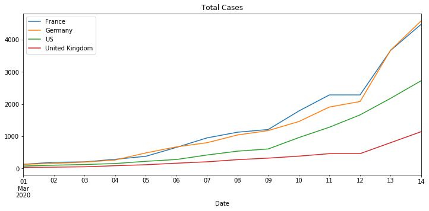
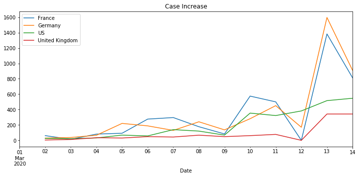
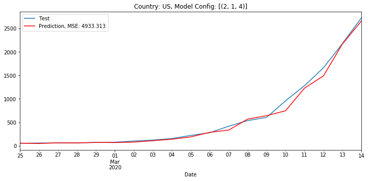
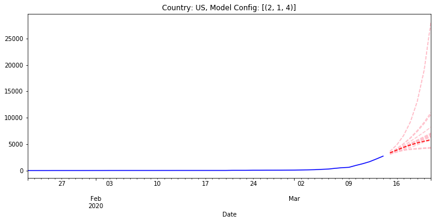
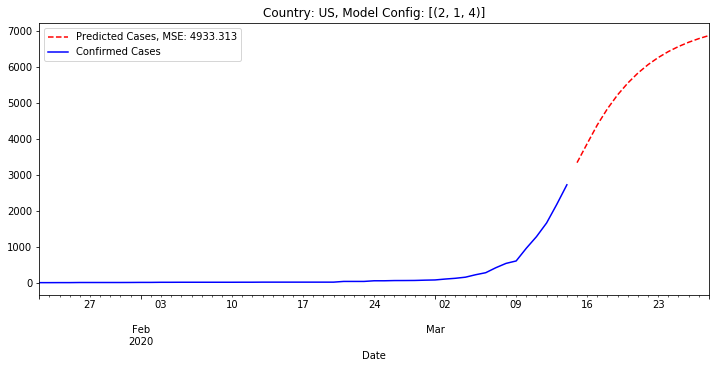

# COVID-19 Time Series Analysis

## Fetch COVID historical case date

* Retrieve data from the [Johns Hopkins Center for Systems Science and Engineering](https://github.com/CSSEGISandData/)
* Merge data into a single DataFrame

## Reformat data for visualization and modeling

Use `plot` to produce total cases and case per day charts for a set of `countries` and `metrics`. If `metrics` is unit we assume it is confirmed cases.

# Naive Time Series Models

> This requires that the `grouped_df` DataFrame and the `all_countries` list exist.

> These models are not run in parallel, but they can be.

> These models are _**incredibly**_ naive, we are only considering the previous case numbers, nothing exogenous.

Use the `prepare_data` function to limit the countries and metrics. Currently this can model univariate data, a single country at a time. It would be interesting to use `VAR` or other multivariate models to capture the interdependence between countries.

We have written forecasting methods for [ARIMA](https://en.wikipedia.org/wiki/Autoregressive_integrated_moving_average) and [Holt Winters Exponential Smoothing](https://en.wikipedia.org/wiki/Exponential_smoothing). Additional forecasting methods in the same format should work fine.

The `grid_search` function takes a map from forecasting functions to a list of configurations per forecasting function and evaluates all using a walk forward method with a 2/3rds training and testing split. There is currently no validation or cross-validation step.

This function returns a list of forecast function, configuration, and mean squared error (MSE) tuples ordered by increasing MSE.

On March 15th, 2020 an ARIMA model with order (2, 1, 4) had the lowest MSE of 4933. The above chart is only showing the testing data, the final 2/3rds of the available data.

Above is the result if we run this model in predictive mode for the next two weeks. And below is thte result for the next week showing all models with a MSE below 20,000 and the best model in dark red.

